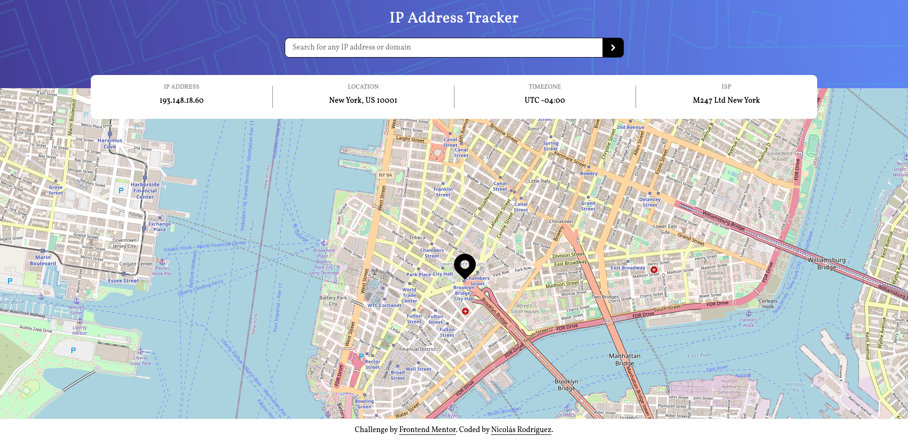
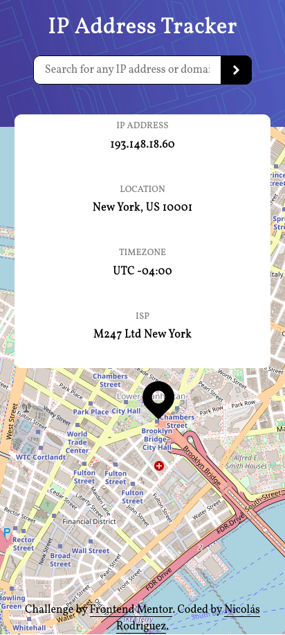

# Frontend Mentor - IP address tracker solution

This is a solution to the [IP address tracker challenge on Frontend Mentor](https://www.frontendmentor.io/challenges/ip-address-tracker-I8-0yYAH0). Frontend Mentor challenges help you improve your coding skills by building realistic projects.

The solution is publicly available at [https://ip-address-tracker-f49c76.netlify.app/](https://ip-address-tracker-f49c76.netlify.app/).

## Table of contents

- [Frontend Mentor - IP address tracker solution](#frontend-mentor---ip-address-tracker-solution)
  - [Table of contents](#table-of-contents)
  - [Overview](#overview)
    - [The challenge](#the-challenge)
    - [Screenshots](#screenshots)
    - [Built with](#built-with)
    - [Observations](#observations)

## Overview

### The challenge

Users should be able to:

- View the optimal layout for each page depending on their device's screen size
- See hover states for all interactive elements on the page
- See their own IP address on the map on the initial page load
- Search for any IP addresses or domains and see the key information and location

### Screenshots

Desktop

Mobile

### Built with

- Semantic HTML5 markup
- CSS custom properties
- Flexbox
- Leaflet
- IP Geolocation API - ipify.org

### Observations

- Doesn't work with Brave browser and some ad-blockers
